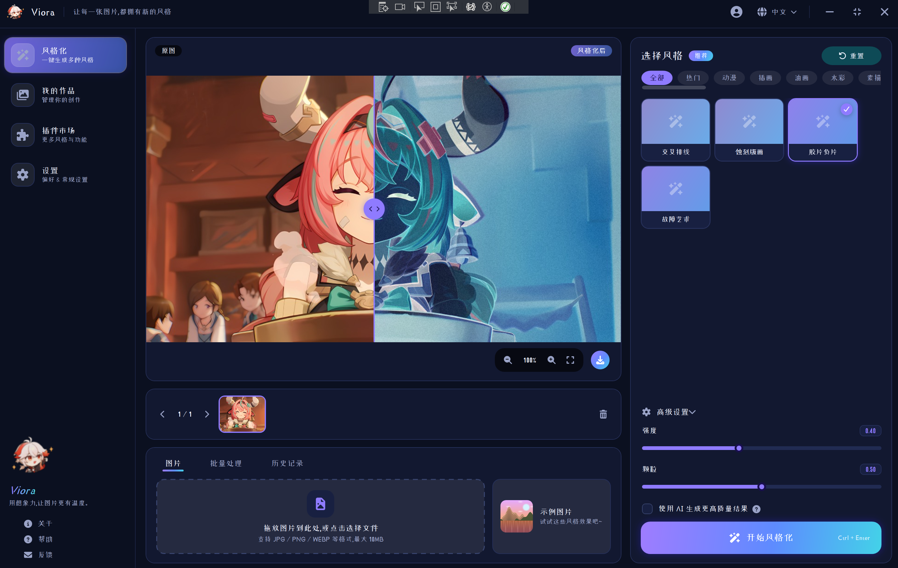
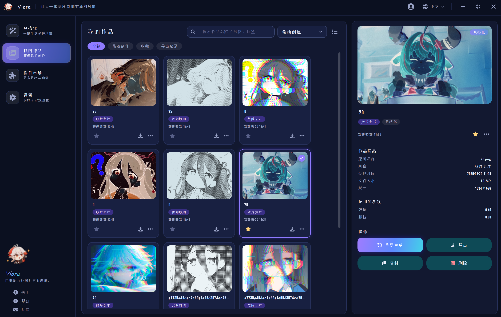
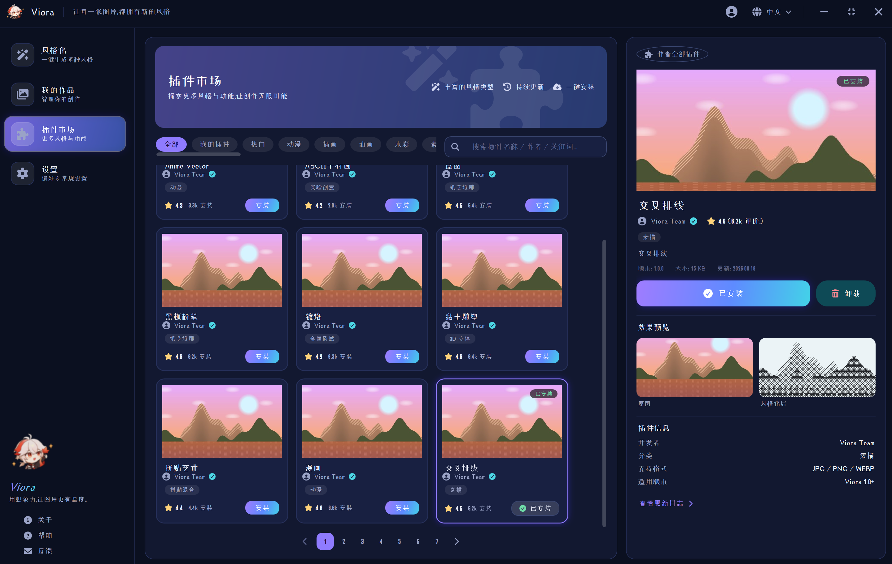
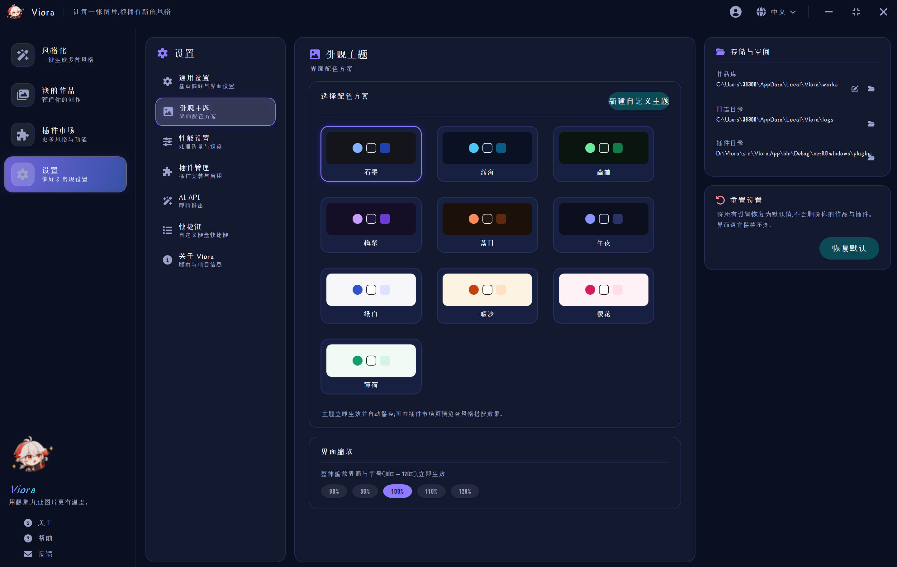

# Viora

**用想象力,让图片更有温度。**

[English](README.md) · 简体中文

Viora 是一款**本地优先**的 Windows 图片风格化应用(WPF / .NET 8)。导入一张照片,一键应用插件提供的艺术风格——官方仓库目前提供 **55 种风格**(水彩、油画、低多边形、黑板粉笔、漫画、蓝图……),全部由插件市场按需安装;客户端与插件完全分离,装多少、卸多少,完全由你决定。

## 界面预览

| 风格化 | 我的作品 |
|---|---|
|  |  |
| **插件市场** | **设置** |
|  |  |

## 功能特性

- **风格化** —— 55 种艺术风格(全部来自插件市场),参数滑杆实时预览、批量处理队列、原图/结果分屏对比、历史记录、失败重试;全部处理在本机完成。
- **插件市场** —— 浏览 / 搜索(名称·作者·标签·描述)/ 分类筛选 / 一键安装卸载;安装 = 从官方 GitHub 仓库真实下载 zip 到程序旁的 `plugins` 文件夹,卸载 = 真删除;直接在资源管理器里增删插件文件夹,效果等同。
- **我的作品** —— 网格 / 列表双视图、收藏、行内重命名、重新生成、创建副本、导出(6 种格式:PNG / JPEG / BMP / TIFF / GIF / WebP)。
- **设置** —— 通用(启动行为、界面语言、导入大小上限、日志目录自定义)、外观(10 套配色方案 + 自定义主题编辑器 + 界面缩放 80%–120%)、性能(交互预览质量、预览/导出尺寸上限、导出格式与 JPEG 质量)、插件管理(总开关 + 逐个启停)、快捷键(可视化录制,默认 Ctrl+Enter 运行、Ctrl+O 导入、Ctrl+1~4 切换页面)、检查更新(对比 GitHub Releases)。
- **双语 + 可扩展语言包** —— 内置简体中文 / English;把翻译 JSON 放进 `languages` 文件夹重启即新增语言(见 [设置与本地化](docs/05-设置与本地化.md)),也欢迎 PR 进主仓库。
- **隐私优先** —— 无账号、无上传、默认无遥测;日志路径默认脱敏。

## 快速开始

1. 从 [Releases](https://github.com/huyangpahuo/Viora/releases/latest) 下载并解压(自带 .NET 运行时,无需额外安装);
2. 启动 Viora → **插件市场** → 安装几个喜欢的风格;
3. 回到 **风格化**,拖入图片,开始创作。

从源码运行:安装 [.NET 8 SDK](https://dotnet.microsoft.com/download/dotnet/8.0) → `dotnet build Viora.sln -c Release` → `dotnet run --project src/Viora.App -c Release`。发布与打包详见 [发布与打包](docs/04-发布与打包.md)。

## 文档

| 文档 | 内容 |
|---|---|
| [01 功能总览](docs/01-功能总览.md) | 四大页面全部功能逐项说明 |
| [02 架构与代码结构](docs/02-架构与代码结构.md) | 项目分层(Mermaid 图)、每个文件夹/文件的作用 |
| [03 插件开发指南](docs/03-插件开发指南.md) | 从零制作一个风格插件并发布到官方市场 |
| [04 发布与打包](docs/04-发布与打包.md) | dotnet publish(x64/x86)、MSIX、微软商店上架 |
| [05 设置与本地化](docs/05-设置与本地化.md) | 每一项设置的作用、字体与保底链、语言包制作 |

## 插件生态

- 官方插件仓库:[huyangpahuo/Viora-plugins](https://github.com/huyangpahuo/Viora-plugins) —— 55 个风格插件的分发源,也是第三方插件的上架入口(提交 PR 即可);
- 插件 = 一个文件夹(`plugin.json` 清单 + 编译好的 DLL),市场里的 zip 就是它的压缩包;放进 `plugins` 文件夹即安装,删掉即卸载;
- 制作自己的风格插件:引用 `Viora.PluginSdk` 写约 30 行入口代码,算法可以是任何托管代码,完整教程见 [插件开发指南](docs/03-插件开发指南.md)。

## 致谢

- [Font Awesome Free](https://fontawesome.com/) —— 应用内全部矢量图标(含 QQ / Discord / Telegram / GitHub 品牌 logo),遵循 [CC BY 4.0](https://creativecommons.org/licenses/by/4.0/) 许可;
- [.NET](https://dotnet.microsoft.com/) / WPF、[CommunityToolkit.Mvvm](https://github.com/CommunityToolkit/dotnet)、Microsoft.Extensions.*(DI / Logging)—— 应用的基础设施;
- **应用图标与看板娘插画**为《原神》角色**枫原万叶**的同人创作,原作者无从考证,仅作非商用界面装饰。**如侵犯了您的权益,请提 Issue 告知,我会立刻删除更换。**

## 参与贡献

欢迎 Issue 与 Pull Request:客户端代码保持分层边界(`Viora.Core` 不出现 WPF 类型);界面文案请同步中英两个语言包;插件上架请前往 [Viora-plugins](https://github.com/huyangpahuo/Viora-plugins) 提交 PR(打包 + `registry.json` 条目)。

## 许可证

见 [LICENSE](LICENSE)。
