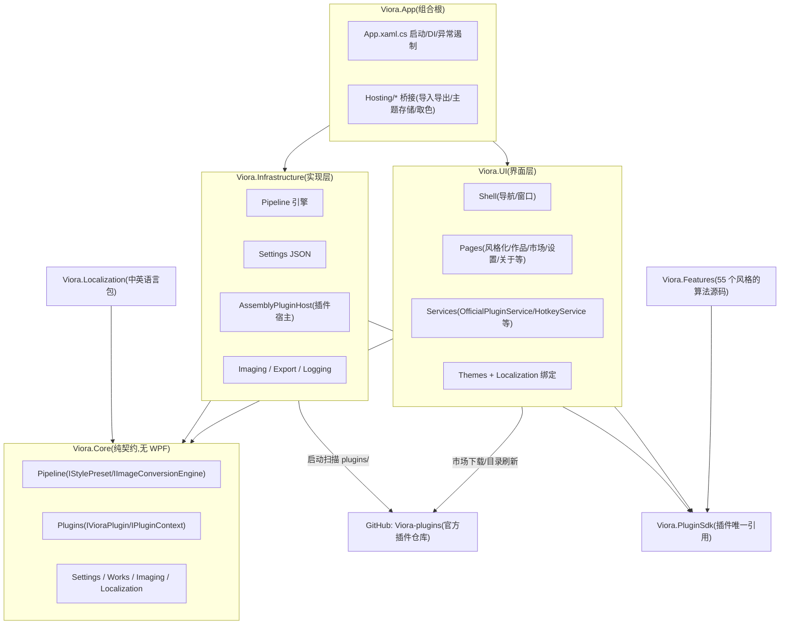
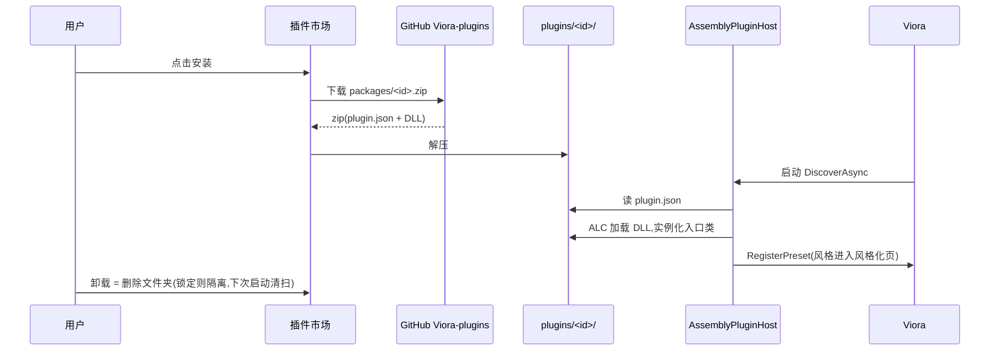

# 02 · 架构与代码结构

## 分层总览

**硬边界**:`Viora.Core` 不引用任何 WPF 类型;WPF 只存在于 `Viora.UI` 与 `Viora.App`。插件永远只依赖 `Viora.PluginSdk`。

## 各项目 / 文件夹职责

| 路径 | 职责 |
|---|---|
| `src/Viora.App` | 组合根:DI 装配、全局异常遏制、文件日志启动、桥接层(HostExportBridge、ImportExportBridges、UserThemeStore、AppAlert、BindingErrorTraceListener)、`languages/` 外置语言包模板 |
| `src/Viora.UI/Shell` | `ShellView/ShellViewModel`:无边框窗口、左侧导航、页面缓存与切换动画、界面缩放变换、语言菜单 |
| `src/Viora.UI/Pages/Stylize` | 风格化页:风格网格/分类 chips、参数面板、批量队列、对比查看器、历史记录(`StylizeViewModel` 是单例,支持跨页"重新生成") |
| `src/Viora.UI/Pages/MyWorks` | 我的作品:双视图卡片/列表、筛选排序、收藏、详情面板(参数按当前语言重本地化) |
| `src/Viora.UI/Pages/PluginMarket` | 插件市场:目录重建、搜索/分类、安装卸载、详情面板、作者插件列表、真实预览渲染缓存 |
| `src/Viora.UI/Pages/Settings` | 设置页:子导航 + 通用/外观/性能/插件管理/快捷键/关于 六分区,全部即时保存 |
| `src/Viora.UI/Pages/Support` | 关于/帮助/反馈三页共享 `SupportViewModel`(社区链接、诊断信息、日志直达) |
| `src/Viora.UI/Services` | `OfficialPluginService`(官方仓库目录/下载/包信息)、`HotkeyService`(快捷键注册表)、`ImportExportProxy`(导入导出/提醒接口)、`AppRestart` |
| `src/Viora.UI/Hosting` | `FeatureRegistry`、`IBuiltInFeature`(内置特性注册缝) |
| `src/Viora.UI/Controls` | `VioraIcon`(几何图标)、`Pager`(分页)、`FormCheckBox` |
| `src/Viora.UI/Themes` | Core/Controls/Converters/各主题 Tokens;`Icons.xaml` 由 icon库 生成的几何库 |
| `src/Viora.Core/Pipeline` | `IStylePreset`(风格预设契约)、`IPresetParameter`、`IImageProcessingStage`、`IImageConversionEngine`(管线执行) |
| `src/Viora.Core/Plugins` | `IVioraPlugin`、`IPluginContext`(注册预设/导出器/文案)、`IPluginHost`(发现/装载/启停/安装卸载)、`PluginMetadata` |
| `src/Viora.Core/Settings` | `VioraSettings` 全量设置模型 + `ISettingsService`(Load/Save/Update) |
| `src/Viora.Core/Works` | `WorkRecord` / `IWorksStore`(作品库契约) |
| `src/Viora.Core/AppLocations.cs` | 插件目录 / 日志目录 / 作品目录的唯一解析入口(exe 旁优先,不可写回退用户目录) |
| `src/Viora.Infrastructure/Plugins` | `AssemblyPluginHost`:扫描 plugins 文件夹、`plugin.json` 清单解析、可收集 ALC 隔离加载、安装/卸载(锁定文件改名隔离 + 启动清扫) |
| `src/Viora.Infrastructure/Settings` | `JsonSettingsService`(防抖落盘) |
| `src/Viora.Infrastructure/Works` | `JsonWorksStore`(works.json + 图片落盘) |
| `src/Viora.Infrastructure/Imaging` | 像素缓冲、导入、WIC 编码导出(PNG/JPEG/BMP/TIFF/GIF/WebP) |
| `src/Viora.Infrastructure/Pipeline` | `ImageConversionEngine`:按阶段列表执行、进度、取消、预览质量 |
| `src/Viora.Infrastructure/Logging` | 文件日志(异步队列)、路径脱敏、`AppPaths` |
| `src/Viora.PluginSdk` | 第三方插件唯一引用:`IVioraPlugin`、`VioraPluginBase`、`IPluginContext`、`ProxyExporter` |
| `src/Viora.Features` | 55 个风格的**算法源码**(预设定义 + 处理阶段);`Convert.Common` 为公共像素运算;`Convert.AnimeVector` 另含宿主导出桥(见下) |
| `src/Viora.Localization` | 中英 JSON 语言包(嵌入资源)+ `JsonLocalizationService`(回退链、插件字符串、**外置 languages/ 扫描**) |
| `Viora-plugins/`(本地镜像,gitignore) | 官方插件仓库镜像:packages/*.zip + registry.json |
| `docs/` | 本文档集与界面截图 |

### 关于 `Viora.Features/Convert.AnimeVector` 为什么独立

- `ExportBridges.cs` 是**宿主必需**的导出桥(App 启动时注册 PNG/JPEG/BMP 导出器与能力常量),编译进主程序;
- `Stages/` 与 `*.Preset.cs` 才是"Anime Vector 风格"的算法源,与其它 54 个风格地位相同;
- 即:**宿主必需代码**与**插件算法源**分放在两个文件夹,合并会破坏这层界线。

## 插件在运行时的真实形态

第三方插件同理:**只有 DLL 成品进入用户机器**,源码留在作者仓库;作者按 `Viora.PluginSdk` 接口开发,编译后的 DLL 自带算法副本。
